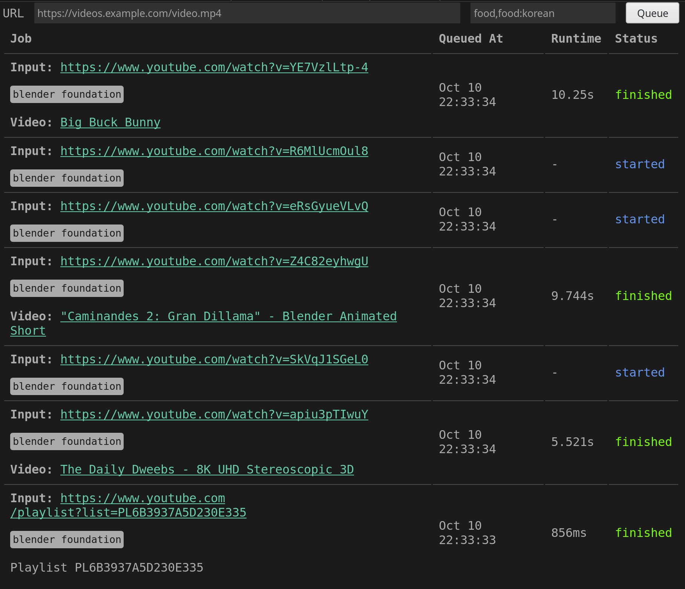
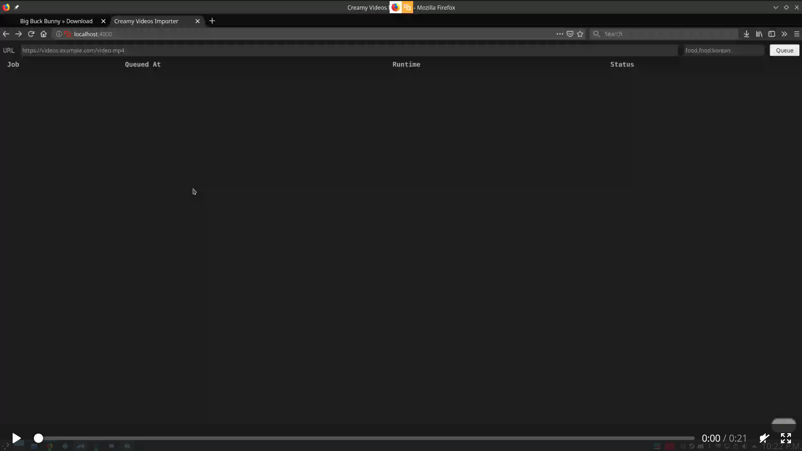

# Creamy Videos Importer

<a href="https://travis-ci.org/AlbinoDrought/creamy-videos-importer"></a>
<a href="https://hub.docker.com/r/albinodrought/creamy-videos-importer">
  
</a>
<a href="https://github.com/AlbinoDrought/creamy-videos-importer/blob/master/LICENSE">
  
</a>

Import videos into a [creamy-videos](https://github.com/AlbinoDrought/creamy-videos) instance using [youtube-dl](https://github.com/ytdl-org/youtube-dl), as a service



## Building

### Without Docker

```
go get -d -v
go build
```

### With Docker

`docker build -t albinodrought/creamy-videos-importer .`

## Running

```
CREAMY_HTTP_PORT=80 \
CREAMY_VIDEOS_HOST=https://videos.example.com/ \
./creamy-videos-importer
```

- `CREAMY_HTTP_PORT`: port to listen on, defaults to `3000`

- `CREAMY_VIDEOS_HOST`: URL for your [creamy-videos](https://github.com/AlbinoDrought/creamy-videos) instance


## Firefox Extension

[](./.readme/extension-in-action.webm?raw=true)

[(alternative video link)](https://creamy-videos.r.albinodrought.com/watch/18)

The extension adds an `Import into Creamy Videos` item to the link and page context menus for a streamlined import flow. On desktop versions of Firefox, the added item will show up when right-clicking a link or an empty area on a page.

The extension source code can be found under the [`firefox-extension`](./firefox-extension) folder. Signed versions ready for installation might be occasionally released on the [releases page](https://github.com/AlbinoDrought/creamy-videos-importer/releases).
